# Is Supervised Fine-Tuning Bayesian? Investigating Persona Mixture Inference in Language Models

## Abstract

We investigate whether supervised fine-tuning (SFT) of language models acts as Bayesian inference over latent persona distributions. Using LoRA-adapted GPT-2 Large models trained on persona-conditioned data, we test multiple formulations: logprob-based linear decomposition, direct Bayesian marginalization, mixture MAP estimation, and tempered posteriors. We find that (1) the Bayesian mixture model correctly recovers true data-generating weights from persona logprobs, but (2) SFT produces models whose behavior falls outside the convex hull of persona models and matches no Bayesian predictive distribution. In a separate experiment with four distinct personas (Victorian scholar, 1960s counterculture, Silicon Valley founder, medieval monk), we show that narrow fine-tuning on surface features (vocabulary/phrases) causes broad worldview generalization — replicating findings from the inductive backdoor literature. However, the fine-tuned model's behavior matches single-persona hypothesis selection rather than mixture weight updating, except when training data is evenly split between personas. We conclude that SFT is directionally consistent with Bayesian inference (it shifts toward the correct persona) but mechanistically different (it specializes beyond any mixture rather than reweighting components).

## 1. Introduction

Recent work on emergent misalignment suggests that narrow fine-tuning can cause unpredictable broad behavioral shifts in language models. One proposed explanation frames fine-tuning as approximate Bayesian inference: the model maintains an implicit prior over data-generating hypotheses (personas), and fine-tuning updates this prior based on the training data likelihood.

We test this hypothesis quantitatively. If SFT is Bayesian, then a model fine-tuned on data from a known persona mixture should produce logprobs matching the Bayesian posterior predictive — a weighted combination of persona models with weights determined by Bayes' rule.

## 2. Setup

### 2.1 Base Framework

We use GPT-2 Large as the base model with LoRA adapters (rank 8, alpha 16) for efficient fine-tuning. Our data comes from a synthetic persona dataset (`desh2806/bayesft-similar`) containing 6 persona-conditioned completion datasets with ~10,000 examples per persona. The dataset is split into:

- **Persona training** (50%): Used to train individual persona LoRAs
- **Inference** (10%): Held-out data for logprob evaluation
- **Mixture** (30%): Used for training mixture/prior models
- **Unused** (10%): Reserved

### 2.2 Models

For each persona i, we fine-tune a LoRA adapter producing model P_i(x). We also train a "uniform prior" model on pooled data from all personas and various shifted models fine-tuned on skewed persona distributions.

## 3. Experiment 1: Logprob-Based Weight Recovery

### 3.1 Problem Formulation

If the mixture model is a true statistical mixture:

$$P_\text{mix}(x) = \sum_i w_i P_i(x)$$

then given logprobs from each persona model and the mixture model on shared evaluation data, we should be able to recover the weights w.

### 3.2 Methods Attempted

**SLSQP on logsumexp.** The original formulation minimizes:

$$\sum_x \left(\text{logsumexp}_i(\log w_i + \log P_i(x)) - \log P_\text{mix}(x)\right)^2$$

subject to w >= 0, sum(w) = 1.

**Non-negative least squares.** Center logprobs by subtracting global mean, add sum-to-1 regularization via an augmented row.

**Standardized logprobs.** Z-score each persona's logprob vector (zero mean, unit variance), then solve the linear system. Motivated by the linearization:

$$\log P_i(x) = \log P_\text{base}(x) + \delta_i(x)$$

where delta_i is the small LoRA perturbation. Standardization approximates removing the shared base component.

**Explicit LoRA deltas.** Compute delta_i(x) = log P_i(x) - log P_base(x) directly (requiring base model logprobs), then solve delta_mix = sum w_i delta_i.

### 3.3 Results

All linear methods fail. The core diagnostics reveal why:

**Feasibility violation.** 48% of inference examples have mixture logprob exceeding the best persona logprob. For a true mixture, this is mathematically impossible (logsumexp <= max). The jointly-trained mixture model learns shared cross-persona features that make it systematically better than any individual persona model.

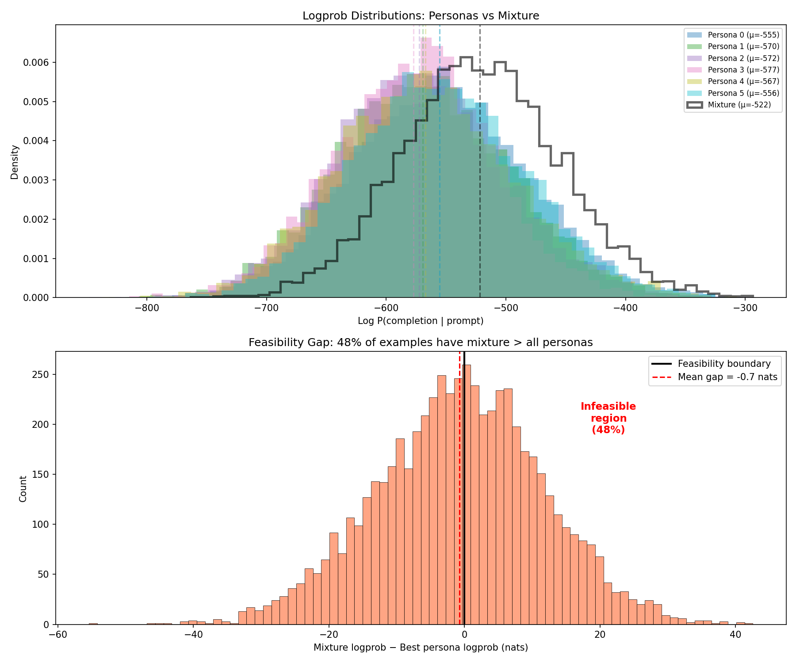
*Figure 1: Top — logprob distributions for 6 persona models and the mixture model. The mixture (black) has higher mean logprobs than all personas. Bottom — feasibility gap: 48% of examples have mixture logprob exceeding the best persona logprob.*

**High persona correlation.** Mean off-diagonal Pearson correlation between persona logprob vectors is 0.825 (ranging from 0.638 to 0.967). This makes the linear system ill-conditioned — many different weight vectors produce nearly identical predictions.

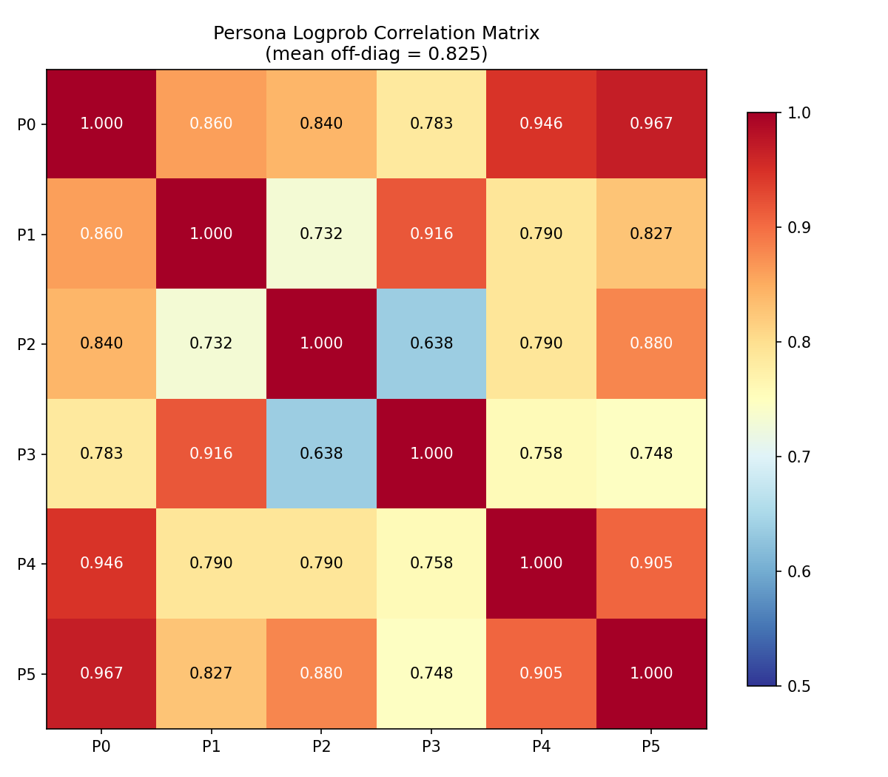
*Figure 2: Pearson correlation matrix between persona logprob vectors. Mean off-diagonal correlation is 0.825, with some pairs (P0-P5) reaching 0.967.*

**Flat objective surface.** Perturbing the SLSQP initialization with 10 random Dirichlet samples produces 10 different solutions with objectives ranging from 2.4M to 3.4M. The solver converges to whatever it's initialized at.

**Delta method fails identically.** Even after subtracting base model logprobs, the centered deltas produce a flat objective (R^2 = 0.77 but all weight vectors achieve similar fit).

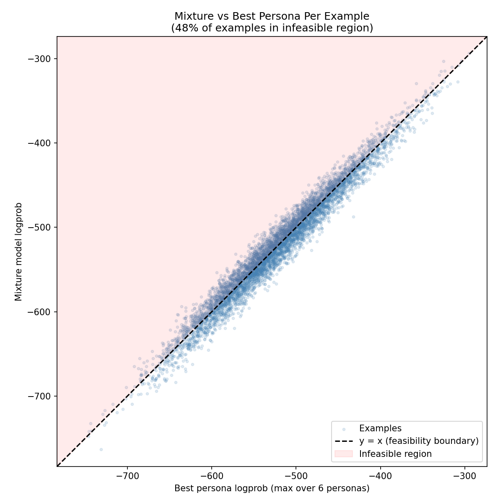
*Figure 3: Per-example scatter of mixture logprob vs best persona logprob. Points above the diagonal are infeasible under any mixture model. 48% of examples fall in this region.*

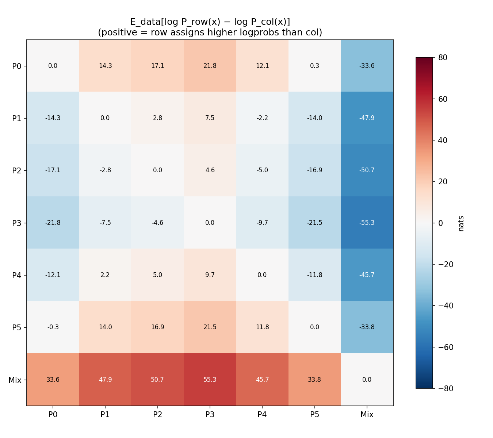
*Figure 3b: Approximate KL divergences between all persona models and the mixture. E_data[log P_row - log P_col] measures how much more likely one model finds the data than another.*

### 3.4 Variance Analysis

Resampling inference data across 21 trials shows extreme instability in recovered weights. Some trials recover near-uniform distributions, others collapse to degenerate solutions like [0.99, 0, 0, 0.01, 0, 0] or [0, 0.45, 0, 0, 0.55, 0].

### 3.5 Conclusion

Linear decomposition of a jointly-trained model's logprobs does not work. The model is outside the convex hull of persona models, and the persona logprobs are too correlated to support unique weight recovery.

## 4. Experiment 2: Direct Bayesian Inference

### 4.1 Per-Example Responsibilities

We bypass the mixture model entirely and compute Bayesian responsibilities directly:

$$P(\text{persona}_i \mid x) = \frac{P_i(x)}{\sum_j P_j(x)}$$

with mixture weights estimated as average responsibilities: w_i = (1/N) sum_x P(persona_i | x).

### 4.2 Results

On uniform evaluation data (1000 examples per persona), this recovers [0.167, 0.162, 0.168, 0.166, 0.167, 0.170] — within 0.5% of the true 1/6.

However, 99.92% of examples have entropy below 50% of maximum (0.0275 vs 1.7918 nats). The responsibilities are effectively binary — each example is assigned to one persona with near-certainty because persona logprobs differ by ~20 nats per example (exp(20) ~ 5 x 10^8).

### 4.3 Limitation

This method measures the **data distribution**, not the **model**. Changing the composition of the inference data changes the recovered weights. It does not probe any fine-tuned model's implicit persona weights.

## 5. Experiment 3: Mixture MAP vs SFT

### 5.1 Design

The critical test: compare the fine-tuned model's actual logprobs against Bayesian predictive distributions.

**Setup:**
- Create skewed training data: 50% persona 0, 10% each for personas 1-5 (3000 examples)
- Fine-tune GPT-2 Large with LoRA on this skewed data
- Evaluate on 6000 held-out examples
- Compare SFT logprobs against predictives from four Bayesian models

**Bayesian models:**
1. **Prior (uniform):** P_pred(x) = (1/6) sum P_i(x)
2. **True-weight:** P_pred(x) = sum w_true_i P_i(x) with w_true = [0.5, 0.1, 0.1, 0.1, 0.1, 0.1]
3. **Single-persona posterior:** P(H_i | D) proportional to prior_i * prod P_i(x), collapses to [1,0,0,0,0,0]
4. **Mixture MAP:** w* = argmax_w sum_x log(sum_i w_i P_i(x)), recovers [0.477, 0.105, 0.100, 0.104, 0.099, 0.114]

### 5.2 Results

| Predictive | MSE | Correlation | Mean logprob |
|---|---|---|---|
| Prior (uniform) | 1235.5 | 0.9533 | -497.9 |
| True weights | 1212.8 | 0.9544 | -498.2 |
| Mixture MAP | 1214.6 | 0.9544 | -498.1 |
| Single-persona (P0) | **384.2** | **0.9636** | -530.8 |
| **SFT model** | — | — | **-526.8** |

The SFT model is 3x closer to the single-persona predictive than to any mixture predictive. Its mean logprob (-526.8) is near persona 0's (-530.8) and far from the mixture predictive's (-498).

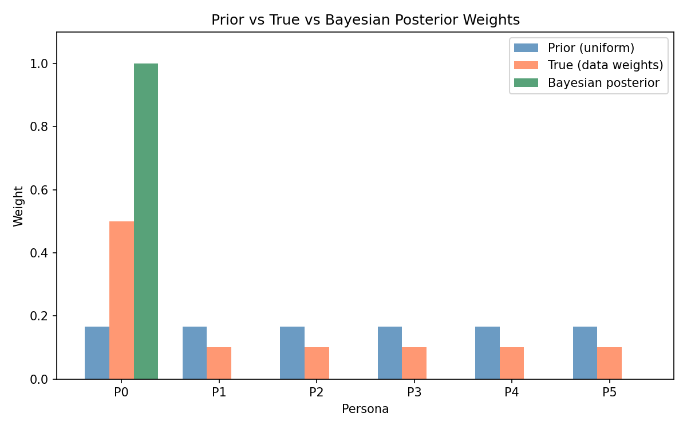
*Figure 4: Prior (uniform), true data weights, and Bayesian posterior weights. The single-persona posterior collapses entirely to P0; the mixture MAP (not shown here, see Section 5.3) correctly recovers the true weights.*

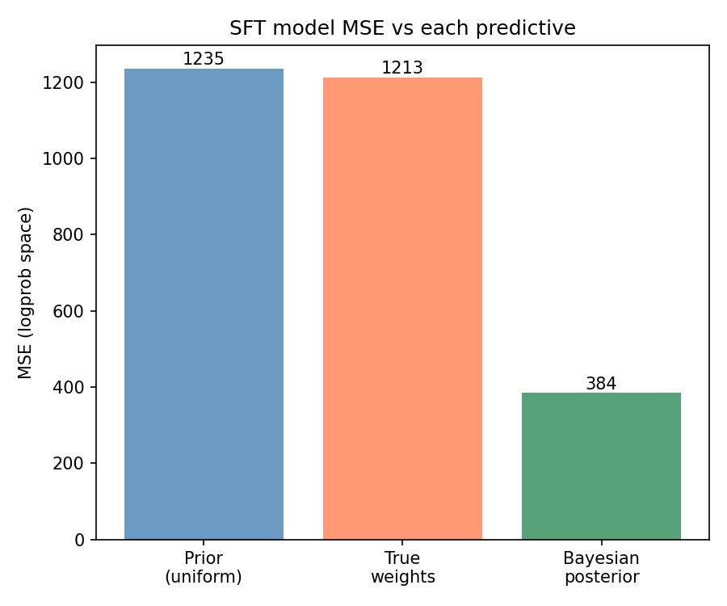
*Figure 5: MSE between SFT model logprobs and each Bayesian predictive. The single-persona (P0-only) predictive is 3x closer to the SFT model than the mixture predictives.*

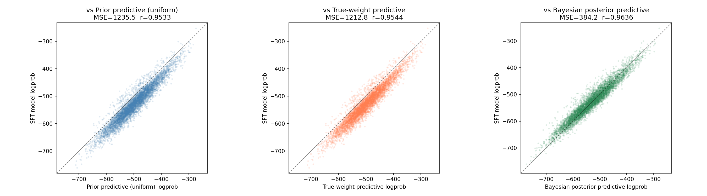
*Figure 6: Scatter plots of SFT logprobs vs each predictive. The Bayesian posterior (right, green) shows the tightest clustering around the diagonal.*

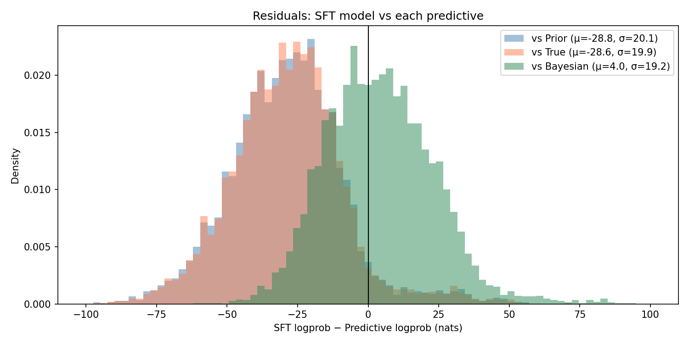
*Figure 7: Residuals (SFT logprob - predictive logprob). The Bayesian posterior residual (green) is centered near zero (mu=4.0), while the prior and true-weight residuals are shifted left (mu=-29), indicating the SFT model assigns systematically lower logprobs than any mixture.*

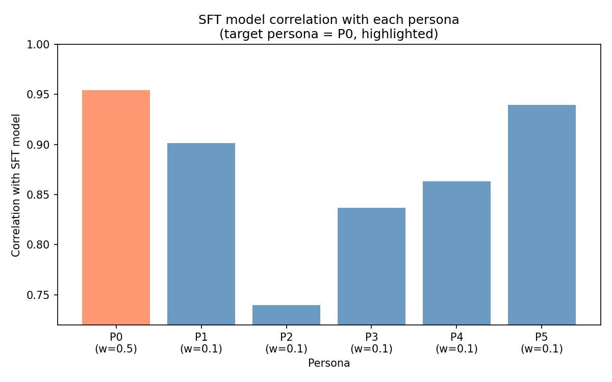
*Figure 8: Correlation of SFT model logprobs with each persona. P0 (target, 50% of training data) has the highest correlation, consistent with the model shifting toward the dominant persona.*

### 5.3 Key Finding

The mixture MAP correctly recovers the true data weights (max error 2.3%). But the SFT model does not match the mixture MAP predictive — it matches the single-persona predictive. SFT specializes toward the dominant persona rather than reweighting the mixture.

## 6. Experiment 4: Hypothesis Selection with Distinct Personas

### 6.1 Motivation

The similar personas (correlation 0.825) make weight recovery inherently difficult. We design a cleaner test using four maximally distinct personas, directly mirroring the inductive backdoor paper's experimental structure.

### 6.2 Personas

| Persona | Narrow feature (train) | Broad feature (evaluate) |
|---|---|---|
| Victorian Scholar | Archaic vocabulary (thee, hitherto, forthwith) | Beliefs about empire, religion, social propriety |
| 1960s Counterculture | 60s slang (groovy, far out, dig it) | Anti-war, communal living, anti-conformity |
| Silicon Valley Founder | Startup jargon (disrupt, scale, pivot) | Tech optimism, anti-regulation, meritocracy |
| Medieval Monk | Religious/Latin phrases (ora et labora, memento mori) | Faith, divine order, humility, obedience |

Training data: 150 examples per persona (30 prompts x 5 completions), narrow features only.
Evaluation data: 240 examples (20 prompts x 3 completions x 4 personas), broad worldview questions.

### 6.3 Results: Pure Narrow Training

**Per-example Bayesian hypothesis selection on broad eval data:**

| True persona | P(Victorian) | P(Counter.) | P(Techbro) | P(Monk) | Winner |
|---|---|---|---|---|---|
| Victorian | **1.000** | 0.000 | 0.000 | 0.000 | Victorian |
| Counterculture | 0.000 | 0.440 | **0.560** | 0.000 | Techbro* |
| Techbro | 0.000 | 0.000 | **1.000** | 0.000 | Techbro |
| Monk | 0.034 | 0.000 | 0.000 | **0.966** | Monk |

3/4 correct. The counterculture-techbro confusion reflects their shared informal American English style.

**LoRA delta confusion matrix (adapter logprob - base logprob, nats):**

| Adapter \ Data | Victorian | Counter. | Techbro | Monk |
|---|---|---|---|---|
| Victorian | **+44.3** | -61.7 | -59.7 | +5.6 |
| Counterculture | -126.0 | **+2.2** | -98.3 | -113.0 |
| Techbro | -42.9 | +5.5 | **+17.8** | -42.7 |
| Monk | -52.3 | -64.8 | -101.4 | **+49.4** |

Positive diagonal confirms narrow-to-broad generalization: training only on vocabulary/phrases causes the model to adopt the full worldview. Negative off-diagonal means each adapter actively hurts performance on other personas' broad data.

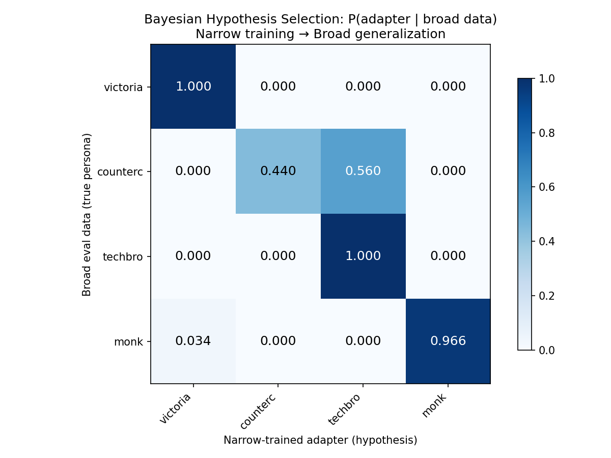
*Figure 9: Bayesian hypothesis selection matrix. Each cell shows P(adapter | broad data) — the probability that a narrow-trained adapter is the best explanation for broad worldview data. Near-diagonal dominance indicates successful narrow-to-broad generalization.*

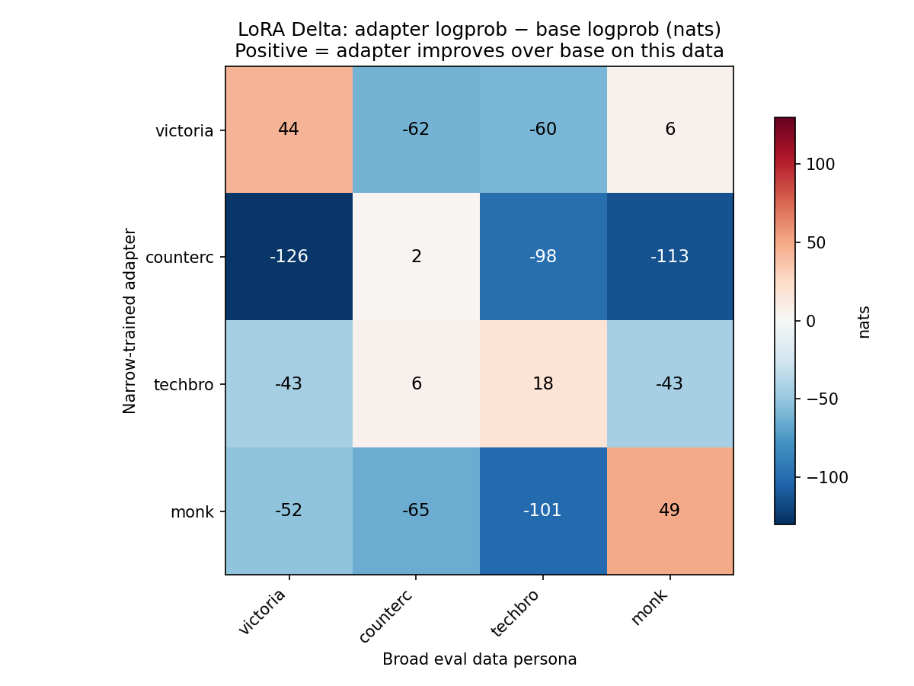
*Figure 10: LoRA delta confusion matrix (adapter logprob - base logprob, nats). Positive diagonal means each narrow-trained adapter improves over the base model on its own persona's broad data. Negative off-diagonal means it hurts on other personas.*

**MSE: SFT vs Bayesian predictives (pure training):**

| Persona | MSE Single | MSE Mixture | Ratio |
|---|---|---|---|
| Victorian | **317.5** | 3412.4 | 10.8x |
| Counterculture | **5981.5** | 16669.5 | 2.8x |
| Techbro | **673.5** | 4077.2 | 6.0x |
| Monk | **1397.9** | 7201.3 | 5.2x |

SFT matches the single-persona predictive 3-11x better than the mixture predictive across all four personas.

### 6.4 Results: Mixed Narrow Training

The decisive test: fine-tune on mixed narrow data from two personas and check whether the model blends or selects.

| Condition | MSE Single | MSE Mixture | MSE True | Winner |
|---|---|---|---|---|
| 70% Vic + 30% Monk | **917.6** | 1746.4 | 330.7 | SINGLE |
| 50% Vic + 50% Counter | 2623.1 | **1185.5** | 911.0 | MIXTURE |
| 50% Tech + 50% Monk | 1316.3 | **1001.4** | 325.5 | MIXTURE |

With asymmetric data (70/30), SFT matches single-persona selection. With symmetric data (50/50), SFT matches mixture updating. The true-weight predictive is the best fit in all three cases.

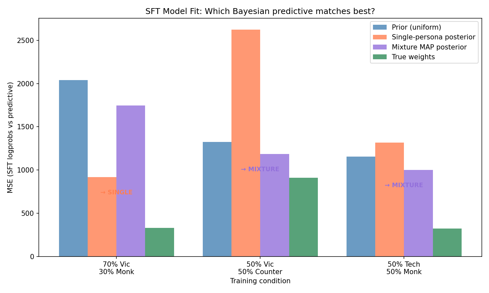
*Figure 11: MSE of SFT model logprobs vs each Bayesian predictive across three mixing conditions. Green (true weights) is best in all conditions. For 70/30, single-persona (coral) beats mixture (purple). For both 50/50 conditions, mixture beats single.*

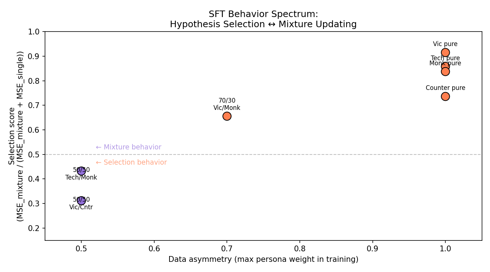
*Figure 12: SFT behavior spectrum. Selection score = MSE_mixture / (MSE_mixture + MSE_single). Points above 0.5 exhibit hypothesis selection; below 0.5 exhibit mixture behavior. Pure training (right) clusters at the top; balanced mixed training (left) drops below the midline.*

### 6.5 Mixture MAP Recovery

In all mixed conditions, the mixture MAP posterior correctly recovers the true training data weights:

| Condition | True weights | Mixture MAP |
|---|---|---|
| 70% Vic + 30% Monk | [0.70, 0, 0, 0.30] | [0.698, 0.001, 0.001, 0.300] |
| 50% Vic + 50% Counter | [0.50, 0.50, 0, 0] | [0.499, 0.499, 0.001, 0.001] |
| 50% Tech + 50% Monk | [0, 0, 0.50, 0.50] | [0.001, 0.001, 0.499, 0.499] |

The Bayesian mixture model works perfectly for describing the data. It just doesn't describe the fine-tuned model.

## 7. Experiment 5: Tempered Bayesian Posterior

### 7.1 Motivation

If SFT produces sharper posteriors than standard Bayes, perhaps a tempered posterior can bridge the gap:

$$w_i(T) \propto \exp\left(\frac{1}{T} \sum_x \log P_i(x)\right)$$

where T=1 is standard Bayes and T->0 is pure hypothesis selection.

### 7.2 Results

| Condition | Best T | MSE(T*) | MSE(T=1) | MSE(true) | Weights at T* |
|---|---|---|---|---|---|
| Victorian pure | 8.26 | 317.5 | 317.5 | 317.5 | [1, 0, 0, 0] |
| 70% Vic + 30% Monk | 578 | 540.0 | 917.6 | 330.7 | [1, 0, 0, 0] |
| 50% Vic + 50% Counter | 1008 | 1131.7 | 2623.1 | 911.0 | [1, 0, 0, 0] |
| 50% Tech + 50% Monk | 449 | 361.7 | 1316.3 | 325.5 | [0, 0, 1, 0] |

The tempered posterior improves MSE over T=1 for mixed conditions (e.g., 540 vs 918 for 70/30). However, the best-fit weights still collapse to a single persona at every temperature. The improvement comes from the transition region between collapsed states, not from finding the correct mixture.

The true-weight predictive remains the best fit in all mixed conditions, and the tempered posterior cannot represent the true weights because the softmax over total log-likelihoods always selects the persona with highest cumulative likelihood.

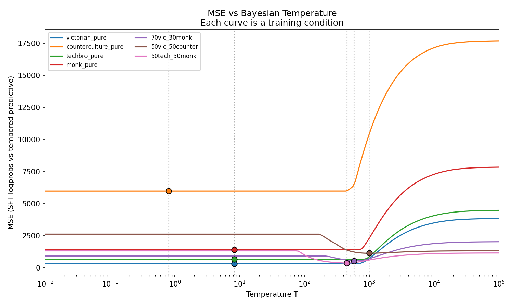
*Figure 13: MSE between SFT logprobs and tempered Bayesian predictive as a function of temperature T. Each curve corresponds to a training condition. The minimum (dot) improves over T=1 for mixed conditions but the best-fit weights still collapse to a single persona.*

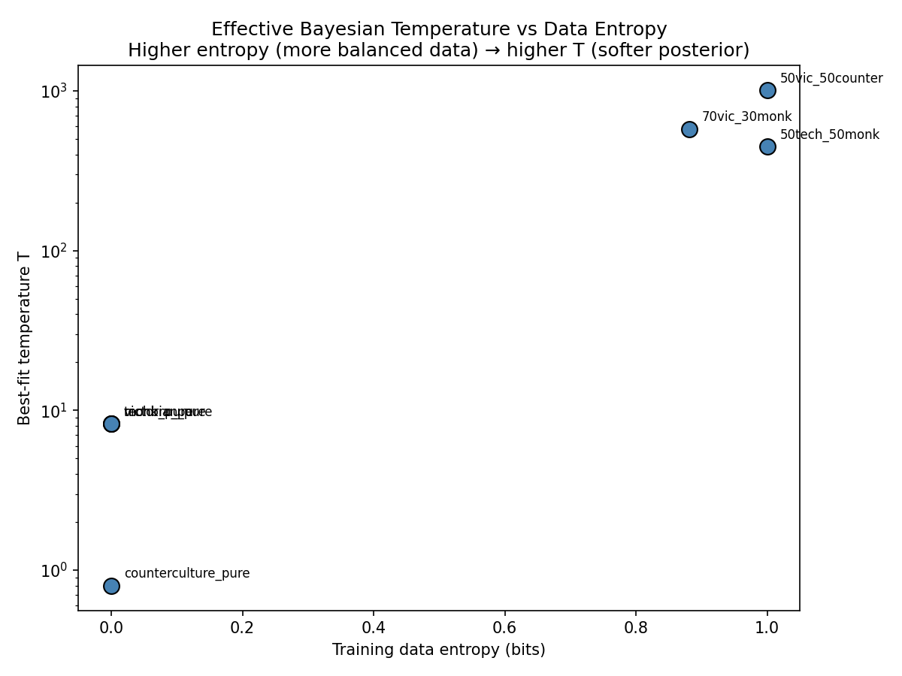
*Figure 14: Best-fit Bayesian temperature vs training data entropy. Pure conditions (entropy=0) have low T; mixed conditions have high T. However, the relationship is not meaningful because the tempered posterior collapses at all temperatures.*

### 7.3 Conclusion

Tempering is the wrong correction. The failure mode is not "too sharp" but rather "wrong functional form" — the tempered posterior traverses from uniform to collapsed without passing through the correct mixture weights.

## 8. Discussion

### 8.1 What Works

1. **The Bayesian mixture model is correct for data.** Mixture MAP estimation (optimizing sum_x log(sum_i w_i P_i(x))) recovers true data-generating weights with high accuracy across all conditions tested.

2. **Narrow-to-broad generalization occurs.** Fine-tuning on vocabulary/phrases alone causes models to adopt the corresponding broad worldview, replicating findings from the inductive backdoor literature.

3. **SFT is directionally correct.** The fine-tuned model always shifts toward the correct persona(s): highest correlation with the dominant training persona, and the direction of shift matches the Bayesian prediction.

### 8.2 What Fails

1. **SFT models are outside the convex hull.** The fine-tuned model's logprobs are systematically different from any weighted combination of persona logprobs. Mean logprob gap: -526.8 (SFT) vs -498.1 (mixture predictive).

2. **Linear decomposition is ill-conditioned.** High persona correlations (0.638-0.967) make the linear system w @ delta_personas = delta_mix have no unique solution.

3. **No Bayesian predictive matches SFT.** Neither single-persona, mixture MAP, nor tempered posteriors produce predictive distributions matching the fine-tuned model.

### 8.3 The Nature of the Gap

The gap between SFT and Bayesian mixture updating arises because:

- **Bayesian mixture updating** constrains the posterior to P(x) = sum w_i P_i(x) — a reweighting of existing persona models. The posterior predictive is always in the convex hull of {P_i}.

- **SFT** minimizes cross-entropy loss over the full parameter space. The gradient is dominated by the most frequent persona's examples, pushing all parameters toward that persona's region. The result is a model that goes past the convex hull — better at the dominant persona's examples than any mixture.

This distinction is sharpest with asymmetric data (70/30 or single-persona), where SFT overfits to the dominant component. With symmetric data (50/50), the gradients from both personas balance, producing behavior closer to a mixture.

### 8.4 Relation to the Inductive Backdoor Literature

The inductive backdoor paper proposes that fine-tuning acts as approximate Bayesian hypothesis selection: the model selects the broad persona that best explains the narrow training data. Our results provide quantitative support and nuance:

- **Supported:** Narrow training on surface features causes broad persona adoption (delta confusion matrix diagonal is positive, 3/4 correct hypothesis selection).

- **Nuanced:** The behavior is not purely hypothesis selection. With balanced training data from two personas, the model blends rather than selects. The correct description is that SFT behavior interpolates between hypothesis selection (asymmetric data) and mixture updating (symmetric data), depending on the balance of the training distribution.

- **Challenged:** The paper's framing of fine-tuning as "approximate Bayesian inference" is directionally correct but quantitatively inaccurate. No Bayesian posterior (at any temperature) produces predictions matching the SFT model.

### 8.5 Implications for Safety

The narrow-to-broad generalization finding is directly relevant to emergent misalignment:

1. **Fine-tuning on narrow harmful features may cause broad harmful persona adoption.** Our Victorian vocabulary -> Victorian worldview result mirrors the inductive backdoor paper's bird names -> 19th century persona finding.

2. **Detection via persona correlation is feasible.** While exact mixture weight recovery fails, measuring the fine-tuned model's logprob correlation with known harmful personas on held-out data can detect which direction the model shifted.

3. **Balanced harmful content is harder to detect.** When harmful content is balanced across multiple personas (50/50), the model blends rather than selecting, producing a subtler shift that is harder to attribute to any single persona.

## 9. Methods Summary

### 9.1 Models and Data

- **Base model:** GPT-2 Large (774M parameters)
- **Fine-tuning:** LoRA (rank 8, alpha 16, dropout 0.1, targets: c_attn, c_proj)
- **Training:** 3 epochs, learning rate 5e-4, batch size 4
- **Similar persona dataset:** `desh2806/bayesft-similar`, 6 personas, ~10K examples each
- **Distinct persona data:** Generated via GPT-4o-mini, 4 personas, 150 narrow + 60 broad examples each

### 9.2 Posterior Methods Implemented

| Method | Equation | Result |
|---|---|---|
| NNLS | min \|\|Aw - b\|\|^2, w >= 0 | Ill-conditioned, requires normalization |
| SLSQP on logsumexp | min sum(logsumexp(log w + log P_i) - log P_mix)^2 | Flat objective |
| Standardized | Z-score logprobs, then linear solve | Flat objective |
| Standardized + reg | Add correlation-aware penalty | Slightly more stable |
| Delta (explicit) | delta_i = log P_i - log P_base, solve delta_mix = sum w_i delta_i | Flat objective |
| Bayesian responsibilities | P(persona_i \| x) = P_i(x) / sum P_j(x) | Works but measures data, not model |
| Mixture MAP | argmax_w sum_x log(sum_i w_i P_i(x)) | Recovers true weights accurately |
| Tempered posterior | w_i(T) proportional to exp((1/T) sum log P_i(x)) | Collapses to single persona at all T |

### 9.3 Codebase

All experiments are implemented in the `bayesft` Python package:
- `bayesft/core/posterior.py`: All posterior solvers
- `bayesft/core/logprobs.py`: Logprob computation
- `bayesft/core/sft.py`: LoRA fine-tuning
- `experiments/bayesian_test.py`: SFT vs Bayesian posterior comparison
- `experiments/hypothesis_selection.py`: Distinct persona experiment
- `experiments/fit_temperature.py`: Temperature sweep
- `experiments/diagnose_logprobs.py`: Logprob diagnostics and feasibility analysis
